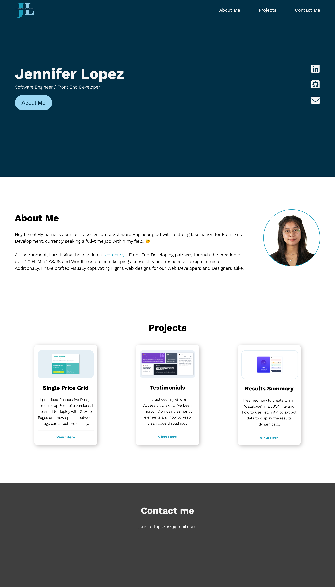
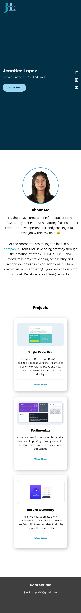

# YW Techlab - Portfolio

## Overview

Hey there, my name is Jennifer and currently pursuing a career in Front End Developing. 
I am taking 4 month web development program with [YW Tech Lab](https://www.ywca-ens.org/economic-advancement/yw-tech-lab/).
I've finished creating a portfolio from [Ania Kubow](https://www.youtube.com/watch?v=-D6oTPA4vXc) and hope to create a more advanced one later on.
I went on the desktop-first approach and I found it harder than mobile-first.

## Result

Feel free to checkout my portfolio
- Portfolio URL: [Jen's Portfolio](https://jen-464.github.io/PortfolioGC/)

### Screenshots
---

 
